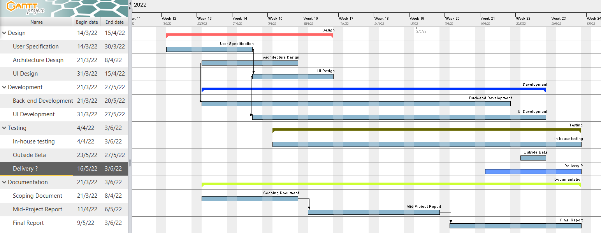
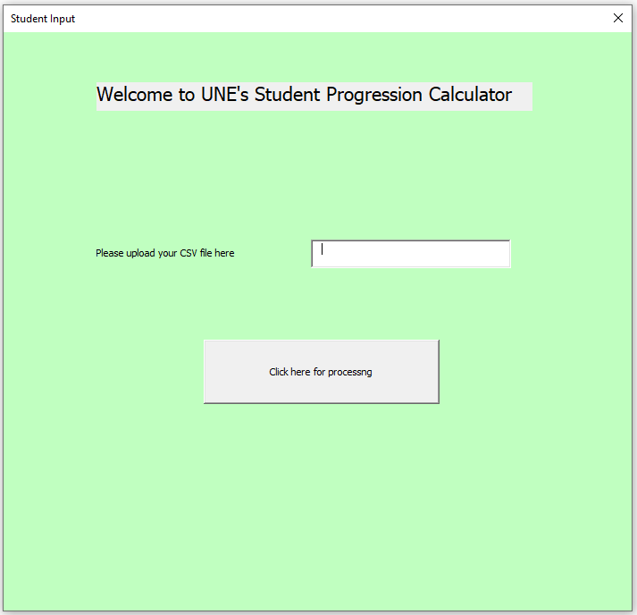
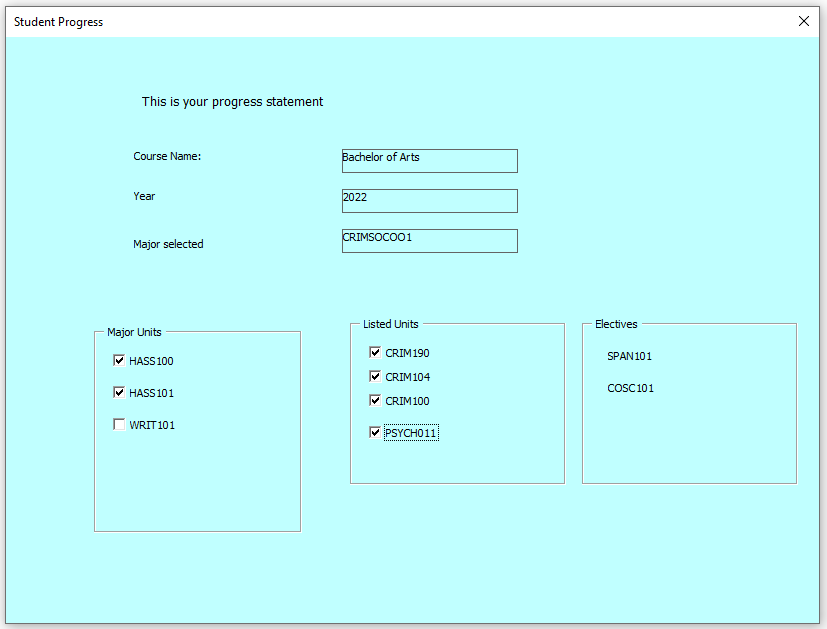

# Degree Completion Roadmap for Students

## Group members and contact details

* Tully McDonald - tmcdon26@myune.edu.au
* Mark Anderson - mander53@myune.edu.au
* Nelson Pray - npray@myune.edu.au
* Nicola Howard - nhoward7@myune.edu.au

## Client name and contact details

Client: Student Services at UNE.  
Contact: Timothy Bartlett-Taylor - tbartle4@une.edu.au  

## A short one paragraph summary of the project

The client, UNE Student Services (SS) requires a working prototype to enable students to complete a self-check to see where they are up to within their degree.
Currently this is a manual process performed by SS which they would like to have automated. The platform should allow for students to input the units they have passed, along with any advanced standing credits, and after selecting a course version, the tool would output the remaining units required to fulfill their degree.

## Specification of client requirements (e.g. in terms of software deliverables, functionality).

##### Input
A student should be able to load information regarding their degree progress onto an online platform for further processing.

These details will include all relevant information such as the course name and version, which Major the student has selected, the names of the units that the student has achieved credits for along with any Advanced Standing credits granted.

[Click here to see a sample](#item1)

##### Processing
After the student submits their course progress, the platform will then process this information using a set of predetermined rules.
These rules will be provided by UNE’s course handbook which is available on their website at https://handbook.une.edu.au/courses/.

Each course and version published in the handbook has a different set of requirements and options available to the student. As such, each course and version combination will need to be encoded into an electronic format that used can be used by the processing engine.
The processing engine will match the student information provided with a one of these electronic rules that have been adapted from the handbook.

##### Output
Once the processing has been completed, the platform will display how the student’s progress compares to the rules from the course handbook. It will identify any mandatory units that have not been completed and provide a list of units that still need to be attempted.

An additional output that the client requested is for the platform to suggest a roadmap that the student can follow. The roadmap would provide the units that still need to be completed along with year and trimester that the unit is next availability. It should be noted that this is an optional output and may not be achieved.

As part of this working prototype, the client is particularly interested to know the time and effort required to develop and produce the platform. A decision to move forward on this project will be dependent on whether the application is feasible within limited time and budget constraints.

[Click here to see a sample]("\item2")

## Statement of Project Scope (as specified by the student group and agreed by the client). 

##### Project goals
This project is a prototype aimed at demonstrating whether there is potential to convert the client’s existing manual process into a fully automated electronic system that requires minimal human intervention. As such, the outcomes of the system do have some flexibility, in that the client has asked that we set about to achieve as much as possible within our limited timeframe.

The fundamental deliverables are
•	Develop a desktop web-based platform that allows a student to upload their current course progress in CSV format.
[Click here to see a sample]("\item3")

•	Create a rule set for the courses being evaluated in this prototype, that is, B.A, B. Comp and B. Nursing for only 2021 and 2022 versions. This rule set will be created manually as we are unable to obtain the correctly formatted rules from the existing API. 

•	The backend of the platform will read the information from the CSV and match it with one of the rule sets (mentioned above) that have been prepared. If there is a match the processing engine will compare the student data to that of the rule set to produce an outcome.
[Click here to see a sample]("\item4")

•	The outcome will be rendered on the web site in a format that is easy to understand. It will also return the results within a 10 second time frame to ensure that the student has a good experience with the platform
•	If the platform is unable to determine for any reason, it should display the reason on the web site and refer the student to SS for further investigation. 

##### Assumptions
•	The student’s course progress will be produced by a system that does not exist. For this prototype the client will provide sample data in the form of CSV files that contain the necessary data.

•	The CSV files provided will be consistent per course and version and will contain all units completed, as well as any units achieved from Advanced Standing. There is no need to differentiate between these. Where applicable it will contain the elected Major for the course.

•	If the information provided indicates that a unit has been completed, the assumption is that the necessary prerequisites have also been satisfied. 

•	We are assuming that the student has satisfied their progression rules. This should be flagged in another UNE system (Callista?)

##### Limitations/constraints
•	The number of courses that can be processed will depend on their complexity. The prototype will concentrate on processing the B.Arts, B.Nursing and B.Comp degrees. If there is time, further work around more complicated degrees can be attempted.

•	The roadmap of how to achieve completion of the degree will be time dependent. If this is developed, the checking of prerequisites for units suggested on the roadmap may not be feasible.

•	It may be difficult obtaining data and feedback from the client timeously due to more pressing commitments.

##### Acceptance criteria
•	The web-site should be visually appealing and easy to use.

•	The outcome displayed to the student must be easily understandable.

•	The outcome produced must be accurate, at least to the same standard as achieved by the manual process. The system will be tested against invalid data to ensure the platform picks up any discrepancies.

•	The system must be able to identify when invalid data is provided and display informative messages to the student should it not be able to produce an outcome. 

##### Exclusions
•	The system to produce the student information in CSV format will not form part of this prototype.

•	Progression rules will not be evaluated. 

•	The results displayed on the website will not be in a format suitable for printing.

## Feasibility Statement (identify technologies required, group skill set, time constraints, resource constraints etc.). 

##### Time constraints
•	As we are limited to the end of Trimester 1, we do have a hard boundary in which to deliver the project.

•	However, as the client’s main focus is to see a working prototype, we should be able to achieve the fundamental requirements. Some shortcuts, such as achieving acceptance on the look and feel may be required.

##### Group skill sets
•	All aspects of this project's skill requirements can be met by multiple team members.

•	All team members have a solid understanding of our end goal for the project and the capabilities to achieve that goal are within the time frame.

##### Resource constraints
•	Acquiring useable course data via an API has proved to be infeasible. However, after consultations with the client, we are able to simulate the data by producing the course data ourselves. 

##### Technologies required
•	This project should be achievable using Open Source software solutions and the prototype should be able to run on UNE Turing’s system.

•	Communication via UNE’s internal email system, Slack, Zoom and Teams as required.

•	Version control is via Github

•	Platform will be built on client-side JavaScript, HTML and CSS

•	There is no need for server-side processing or data storage. As mentioned the website will be hosted on Turing.

•	No additional software, training, libraries, hosting, or other resources are anticipated to be required

##### Budget
•	No financial budget has been specified by the client. 

•	There are no foreseeable upfront costs as outlined under Technologies required.

##### Overall
•	We will deliver a product the fulfills the client’s needs within schedule.

•	That is: A website to demonstrate the potential look, feel, and functionality of the proposed tool.

•	Should time permit; further graphical enhancements and/or core functionality beyond project specifications may be possible

## Assignment of Team Member Responsibilities. 

* Coordinator: Nicola
* Documentation: Nicola, Mark
* Web Design: Tully, Nelson
* Overall technical design and architecture: All
* Development and testing: All
 
 
## Project timeline specified using a Gantt chart. 

## Identification of project risks (add brief comments on how they might be addressed if encountered). 

##### Availability of group members and the client.
•	This is a critical component to the success of the project, as having key stakeholder unavailability may significantly delay the project (already experienced in the initial weeks due to illness and/ leave)

We are now in contact with other stakeholders at SS, so we do have other alternatives should our key stakeholder be unavailable.

•	Team members keeping very different schedules may prove a challenge for communications and for ensuring that consistent progress is made 

After some initial teething problems in getting the group together, we seem to have been able to find suitable time for a weekly meeting. 
Once we are underway with the main development side, it will be easier to work independently due to version control tools.
Additionally, access to Slack is seamless so a response to a question can be obtain from a team member at any time of the day.

#####Simulation of course handbook rules.
•	There may be fringe cases that make electronic processing of the rules difficult or impossible to implement.
•	Lack of understanding, or overlooking an important consideration may lead to incorrect results.

As this is a prototype whether the concept is feasible we don’t foresee this as a major risk. If we are unable to process the simpler degrees it will provide the necessary proof that the overall project is not achievable.
On the other hand, some of these errors of encoding the rules may easily be mitigated by having a stakeholder who has experience with the course handbook evaluate our generated files.

##### Time constraints
•	As we have already faced several delays early in the project, time is a consideration moving forward.

We believe that we should not encounter further significant delays in the coming weeks. We have a good understanding of what is required and should be able to move forward with developing the prototype.

##### Further development
•	The feasibility of a more robust and universal version of our project remains uncertain as is it entirely reliant on the existence and accessibility of computer-readable course data.

This again is deemed low risk for this project. It will be the client’s decision as to how they want to move forward based on the outcome of this project. 

## Appendix
##### <a name="item1">Item 1</a>: 

##### <a name="item2>Item 2</a>: Sample of student information capture form

##### <a name="item3">Item 3</a>: Sample of student progress - output display

##### <a name="item4">Item 4</a>: 

